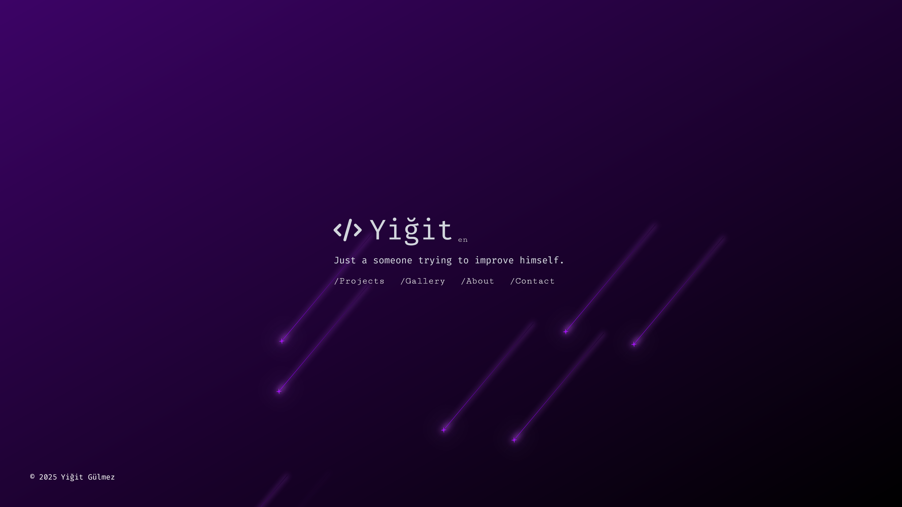

<div align="center">
  
</div>

<p align="center">
  <a href="https://github.com/yigitgulmez/my-world/blob/master/README.tr.md">[𝙏𝙍]</a> - <a href="https://github.com/yigitgulmez/my-world/blob/master/README.md">[𝙀𝙉]</a>
</p>

<h1 align="center">
  my-world - v2
</h1>

<p align="center">
  This project <a href="https://yigitgulmez.com" target="_blank">yigitgulmez.com</a> was built with <a href="https://www.nextjs.org/" target="_blank">Next.js</a> and is hosted on <a href="https://www.vercel.com/" target="_blank">Vercel</a>.
</p>
<p align="center">
  Originally my first web project, now updated as V2.
</p>

<p align="center">
  <a href="https://github.com/yigitgulmez/my-world/releases/tag/v1" target="_blank">🔗 V1 Files</a> |
  <a href="https://my-world-hh1pwsiy3-yigitgulmez-projects.vercel.app" target="_blank">🔍 V1 Preview</a>
</p>



## ❗ Notes

- You need to set the files before running the site!

```sh
# /.env.locale
GET_PROJECTS_API_KEY=
GITHUB_TOKEN=
GITHUB_WEBHOOK_SECRET=
NEXT_PUBLIC_TURNSTILE_SITE_KEY=
TURNSTILE_SECRET=
SMTP_HOST=
SMTP_PORT=
SMTP_USER=
SMTP_PASSWORD=
EMAIL_RECEIVER=
DB_KEY=
DB_URL=
```

```sh
# /src/utils/config.ts
username: 'username',
fullName: 'name surname',
domain: 'domain.com',
githubOwner: 'username',
repos: [
  { name: 'my-world', isLive: <boolean> },
],
socials: [
  { href: 'https://example.com/username', icon: CiLink },
],
skills: [
  { icon: FaReact },
],
```

## 🧩 Customization

- If you want to change the nav items, edit this:

```sh
# /src/utils/nav-items.ts
{ href: `/${locale}/projects`, label: '/' + t('projects.title') },
{ href: `/${locale}/gallery`, label: '/' + t('gallery.title') },
{ href: `/${locale}/about`, label: '/' + t('about.title') },
{ href: `/${locale}/contact`, label: '/' + t('contact.title') },
```

- If you want to add custom project links, edit this:

```sh
# /src/utils/link-list.ts
'my-world': [{ href: "https://example.com", icon: CiUser }],
```

- If you want to add other project content, edit this:

```sh
# /src/messages/*.json
"projects": {
...
  "my-world": {
    "title1": "Projects1",
    "content1": "My project content1"
    "title2": "Projects2",
    "content2": "My project content2"
  }
}
```

## ⚙️ Installation & Set Up

1. Install dependencies

```sh
npm install
```

1. Start the development server

```sh
npm run dev
```

## 🚀 Building and Running for Production

1. Generate a full static production build

```sh
npm run build
```

1. Preview the site as it will appear once deployed

```sh
npm run start
```

1. Run a memory test to evaluate performance and stability.

```sh
npm run memory
```
